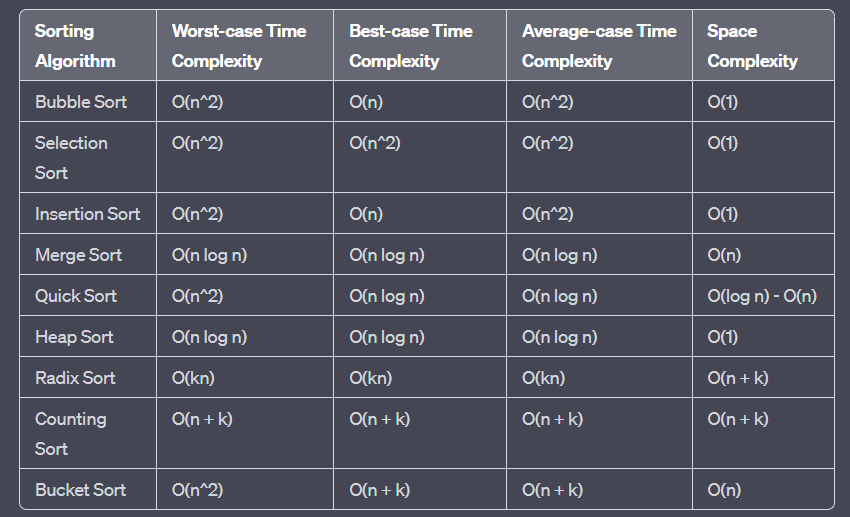
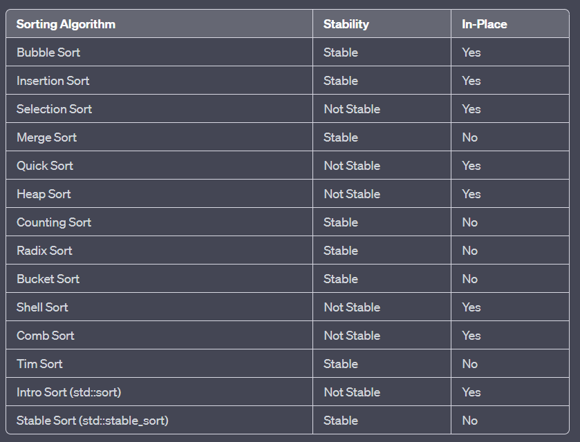

## Day 15

# Selection sort

    - Selection sort is a simple and efficient sorting algorithm that works by repeatedly selecting the smallest (or largest) element from the unsorted portion of the list and moving it to the sorted portion of the list.

    - The algorithm maintains two subarrays in a given array.

        The subarray which already sorted.   
        The remaining subarray was unsorted.  
        In every iteration of the selection sort, the minimum element (considering ascending order) from the unsorted subarray is picked and moved to the beginning of the sorted subarray.

        After every iteration sorted subarray size increase by one and the unsorted subarray size decrease by one.

        After the N (size of the array) iteration, we will get a sorted array.

    -   void selectionSort(int array[], int size) {
            for (int i = 0; i < size - 1; i++) {
                int minIndex = i;
                for (int j = i + 1; j < size; j++) {
                    if (array[j] < array[minIndex]) {
                        minIndex = j;
                    }
                }
                swap(array[i], array[minIndex]);
            }
        }

    - TC -> O(N^2)
    - Selection sort makes O(n) swaps
    - Selection sort makes the minimum swaps, so whenever the swap operation is costly, we use selection sort.

## Is Selection Sort Algorithm stable?

    - The default implementation is not stable. However, it can be made stable.

    - Selection sort works by finding the minimum element and then inserting it in its correct position by swapping with the element which is in the position of this minimum element. This is what makes it unstable.

    - Selection sort can be made Stable if instead of swapping, the minimum element is placed in its position without swapping i.e. by placing the number in its position by pushing every element one step forward(shift all elements to left by 1).
    In simple terms use a technique like insertion sort which means inserting element in its correct place.

## Is Selection Sort Algorithm in place?

    - Yes

## Advantages of Selection Sort

    - It is stable
    - No extra space
    - Works well with small datasets.
    - It is easy to modify to sort in ascending or descending order.

## Disadvantages of the Selection Sort Algorithm:

    - Selection sort has a time complexity of O(n^2) in the worst and average case.
    - Does not work well on large datasets.
    - Selection sort has poor cache performance and hence it is not cache friendly.
    - Not adaptive, meaning it doesn’t take advantage of the fact that the list may already be sorted or partially sorted
    - It is not a parallelizable algorithm, meaning that it cannot be easily split up to be run on multiple processors or cores.

# Insertion sort

    - Insertion sort is a simple sorting algorithm that works similar to the way you sort playing cards in your hands. The array is virtually split into a sorted and an unsorted part. Values from the unsorted part are picked and placed at the correct position in the sorted part.

    - Insertion sort is adaptive in nature, i.e. it is appropriate for data sets which are already partially sorted.

    - Insertion sort is a comparison-based algorithm.

    -   procedure insertionSort(arr):

            for i = 1 to n-1

                j = i

                while j - 1 >= 0 and arr[j - 1] > arr[j]
                    swap arr[j-1] with arr[j]
                    j--

                end while
            end for

        end function

    - Time Complexity of Insertion Sort
        worst case -> O(N^2)
        average case -> O(N^2)
        best case is -> O(N).

## Recursive Implementation

    void recursiveInsertionSort(vector<int>& arr, int n)
    {
        if (n <= 1) {
            return;
        }

        recursiveInsertionSort(arr, n - 1);

        j = n-1;

        while j - 1 >= 0 and arr[j - 1] > arr[j]
            swap arr[j-1] with arr[j]
            j--

        end while
    }

## What are the Boundary Cases of the Insertion Sort algorithm?

    Insertion sort takes maximum time to sort if elements are sorted in reverse order. And it takes minimum time (Order of n) when elements are already sorted.

## What are the Algorithmic Paradigm of Insertion Sort algorithm?

    Insertion Sort algorithm follows incremental approach.

## Is Insertion Sort a stable algorithm?

    Yes

## When is the Insertion Sort algorithm used?

    Insertion sort is used when number of elements is small. It can also be useful when input array is almost sorted, only few elements are misplaced in complete big array.

## What is Binary Insertion Sort?

    We can use binary search to reduce the number of comparisons in normal insertion sort. Binary Insertion Sort uses binary search to find the proper location to insert the selected item at each iteration. In normal insertion, sorting takes O(i) (at ith iteration) in worst case. We can reduce it to O(logi) by using binary search. The algorithm, as a whole, still has a running worst case running time of O(n^2) because of the series of swaps required for each insertion. Refer this for implementation.

## Insertion sort for linked list

    - Take three pointers prev2, prev and curr.
    - put a pointer at the start and compare the two pointers to make links

## Is Insertion Sort a Greedy Algorithm?

    No, insertion sort is not a greedy algorithm.

    A greedy algorithm is an algorithm that makes a locally optimal choice at each step with the hope of finding a global optimum.

    Insertion sort does not make any locally optimal choice but instead inserts each element in its correct position to achieve the global optimum.

# Merge sort

    - Merge sort is defined as a sorting algorithm that works by dividing an array into smaller subarrays, sorting each subarray, and then merging the sorted subarrays back together to form the final sorted array.

    -   step 1: start

        step 2: declare array and left, right, mid variable

        step 3: perform merge function.
            if left > right
                return
            mid= (left+right)/2
            mergesort(array, left, mid)
            mergesort(array, mid+1, right)
            merge(array, left, mid, right)

        step 4: Stop

    - TC - O(N log(N))

    - Recurrence relation -> T(n) = 2T(n/2) + θ(n)

    - A list of n string, each of length n, is sorted into lexicographic order using the merge-sort algorithm. The worst case running time of this computation is O (n^2 log n)  .

    - Given two sorted list of size m and n respectively. The number of comparisons needed the worst case by the merge sort algorithm will be m + n - 1

## Is Merge sort Stable?

    Yes

## How can we make Merge sort more efficient?

    - Merge sort can be made more efficient by replacing recursive calls with Insertion sort for smaller array sizes, where the size of the remaining array is less or equal to 43 as the number of operations required to sort an array of max size 43 will be less in Insertion sort as compared to the number of operations required in Merge sort.

## Applications of Merge Sort:

    - Sorting large datasets

    -  External sorting: Merge sort is commonly used in external sorting, where the data to be sorted is too large to fit into memory. Merge sort can be adapted to work with external storage devices like hard drives or tape drives, making it useful for applications like sorting large files or processing data streams.

    - Merge sort is a naturally parallelizable algorithm, which means it can be easily adapted to work with multiple processors or threads. This makes it useful for applications that require high-performance computing, such as scientific simulations or financial modeling.

    - Merge sort is a stable sorting algorithm, This makes it useful in applications where preserving the original order of equal elements is important, such as in databases or financial systems.

## Advantages of Merge Sort:

    - Stability
    - Guaranteed worst-case performance
    - Parallelizable

    - Memory efficient: Merge sort has a space complexity of O(n), which means it can sort datasets that are larger than the available memory on a machine. This makes it useful for applications where memory usage is a concern.

    - Versatility: Merge sort can be used to sort a wide range of data types, including integers, floating-point numbers, and strings.

    - Adaptability: Merge sort can be adapted to handle different input distributions, such as partially sorted, nearly sorted, or completely unsorted data. This makes it useful in a variety of real-world applications.

## Drawbacks of Merge Sort:

    - Space complexity

    - Recursive algorithm: Merge sort is a recursive algorithm, which can result in a large number of function calls and stack usage for very large datasets. This can cause stack overflow errors or other performance issues.

    - Not in-place

    - Not always optimal for small datasets: Merge sort has a higher time complexity than some other sorting algorithms, such as insertion sort, for small datasets. This can result in slower performance for very small datasets.

    - Complexity of implementation

# Quick sort

    - QuickSort is a sorting algorithm based on the Divide and Conquer algorithm that picks an element as a pivot and partitions the given array around the picked pivot by placing the pivot in its correct position in the sorted array.

    - Recurence relation

        T(n) = T(k) + T(n-k-1) + theta(n)

        - The first two terms are for two recursive calls, the last term is for the partition process. k is the number of elements that are smaller than the pivot.

## Worst Case:

    - The worst case occurs when the partition process always picks the first or last element as the pivot.
    -  the worst case would occur when the array is already sorted in increasing or decreasing order. Following is the recurrence for the worst case.

    -   T(N) = T(0) + T(N-1) + theta(N) which is equivalent to
        T(N) = T(N-1) + theta(N)

    - O(N^2).

## Best Case:

    - The best case occurs when the partition process always picks the middle element as the pivot. The following is recurrence for the best case.

    - T(N) = 2T(N/2) + theta(N)
    -  O(N * logN)

## Average Case:

    - T(N) = T(N/9) + T(9N/10) + theta(N)
    -  O(N * logN)

- Although the worst case time complexity of QuickSort is O(N2) which is more than many other sorting algorithms like Merge Sort and Heap Sort, QuickSort is faster in practice, because its inner loop can be efficiently implemented on most architectures and in most real-world data. QuickSort can be implemented in different ways by changing the choice of pivot so that the worst case rarely occurs for a given type of data. However, merge sort is generally considered better when data is huge and stored in external storage.

## Advantages of Quick Sort:

    - It is a divide-and-conquer algorithm that makes it easier to solve problems.
    - It is efficient on large data sets.
    - It has a low overhead, as it only requires a small amount of memory to function.

## Disadvantages of Quick Sort:

    - It has a worst-case time complexity of O(N2), which occurs when the pivot is chosen poorly.
    - It is not a good choice for small data sets.
    - It is not a stable sort

## Hoare’s vs Lomuto Partition

    -  C:\Users\usar\.vscode\.vscode\c++codes\4_Searching_And_Sorting\Quicksort.cpp

    -  the above implementation is Lomuto Partition. A more optimized implementation of QuickSort is Hoare’s partition which is more efficient than Lomuto’s partition scheme because it does three times less swaps on average.

    - C:\Users\usar\.vscode\.vscode\c++codes\4_Searching_And_Sorting\Hoare_Partition_Quicksort.cpp

    - Hoare’s Partition Scheme works by initializing two indexes that start at two ends, the two indexes move toward each other until an inversion is (A smaller value on the left side and greater value on the right side) found. When an inversion is found, two values are swapped and the process is repeated.

    --------------NOTE---------------

    - If we change Hoare’s partition to pick the last element as pivot, then the Hoare’s partition may cause QuickSort to go into an infinite recursion.

    - Like Lomuto’s partition scheme, Hoare partitioning also causes Quick sort to degrade to O(n^2) when the input array is already sorted, it also doesn’t produce a stable sort.

    - Note that in this scheme, the pivot’s final location is not necessarily at the index that was returned, and the next two segments that the main algorithm recurs on are (lo..p) and (p+1..hi) as opposed to (lo..p-1) and (p+1..hi) as in Lomuto’s scheme.

    - Hoare's partition doesn’t fix the pivot element in the correct position whereas Lomuto's Partiton fixes the pivot element in the correct position.

## Is QuickSort stable?

    NO, However, any sorting algorithm can be made stable by considering indices as a comparison parameter.

## Is QuickSort In-place?

    Yes

## What is 3-Way QuickSort?

    In simple QuickSort algorithm, we select an element as pivot, partition the array around pivot and recur for subarrays on left and right of pivot.
    Consider an array which has many redundant elements. For example, {1, 4, 2, 4, 2, 4, 1, 2, 4, 1, 2, 2, 2, 2, 4, 1, 4, 4, 4}. If 4 is picked as pivot in Simple QuickSort, we fix only one 4 and recursively process remaining occurrences. In 3 Way QuickSort, an array arr[l..r] is divided in 3 parts:

    arr[l..i] elements less than pivot.
    arr[i+1..j-1] elements equal to pivot.
    arr[j..r] elements greater than pivot.

    The idea of 3 way Quick Sort is to process all occurrences of the pivot and is based on Dutch National Flag algorithm.

## Why Quick Sort is preferred over MergeSort for sorting Arrays ?

    - Quick Sort in its general form is an in-place sort (i.e. it doesn’t require any extra storage) whereas merge sort requires O(N) extra storage, N denoting the array size which may be quite expensive.

    - Allocating and de-allocating the extra space used for merge sort increases the running time of the algorithm. Comparing average complexity we find that both types of sorts have O(N logN) average complexity but the constants differ. For arrays, merge sort loses due to the use of extra O(N) storage space.

    - Most practical implementations of Quick Sort use randomized versions. The randomized version has an expected time complexity of O(N logN). The worst case is possible in the randomized version also, but the worst case doesn’t occur for a particular pattern (like sorted array) and randomized Quick Sort works well in practice.

    - Quick Sort is also a cache friendly sorting algorithm as it has a good locality of reference when used for arrays.

## Why MergeSort is preferred over QuickSort for Linked Lists ?

    - In the case of linked lists, the case is different mainly due to the difference in memory allocation of arrays and linked lists. Unlike arrays, linked list nodes may not be adjacent in memory.

    - Unlike arrays, in linked lists, we can insert items in the middle in O(1) extra space and O(1) time. Therefore merge operation of merge sort can be implemented without extra space for linked lists.

    - Unlike arrays, we can not do random access in linked lists. Quick Sort requires a lot of this kind of access. In a linked list to access the ith index, we have to travel each and every node from the head to ith node as we don’t have a continuous block of memory. Therefore, the overhead increases for quicksort. Merge sort accesses data sequentially and the need for random access is low.

# Counting sort

    - Counting sort is a sorting technique based on keys between a specific range. It works by counting the number of objects having distinct key values (a kind of hashing). Then do some arithmetic operations to calculate the position of each object in the output sequence.

    - It is not a comparison-based algorithm

    - It is a stable sort

    - Time complexity
        O(n+k) time when elements are in the range from 1 to k.

    - Space complexity
        O(k) and k (range) can be very large

# Radix sort

    - counting sort take to much extra space if the range is large.

    - The idea of Radix Sort is to do digit by digit sort starting from least significant digit to most significant digit. Radix sort uses counting sort as a subroutine to sort.

    - https://www.youtube.com/watch?v=9QSgBO9yjKU

    - The time complexity of radix sort is O(d * (n + b)), where n is the number of elements to be sorted, d is the number of digits or passes required to sort the elements, and b is the base or the number of distinct values for each digit.

    - Space complexity ->  O(n + k). The algorithm also needs space to store the buckets for each digit. The number of buckets required is determined by the range of input values. If the range is small, such as for integers, the space complexity for the buckets is O(k). However, if the range is large, the space complexity may increase accordingly.

## Advantages:

    - Radix sort has a linear time complexity, which makes it faster than comparison-based sorting algorithms such as quicksort and merge sort for large data sets.

    - It is a stable sorting algorithm, meaning that elements with the same key value maintain their relative order in the sorted output.

    - Radix sort is efficient for sorting large numbers of integers or strings.

    - It can be easily parallelized.

## Disadvantages

    - Radix sort is not efficient for sorting floating-point numbers or other types of data that cannot be easily mapped to a small number of digits.

    - It requires a significant amount of memory to hold the count of the number of times each digit value appears.

    - It is not efficient for small data sets or data sets with a small number of unique keys.

    - It requires that the data being sorted can be represented in a fixed number of digits, which may not be the case for some types of data.

# Bucket Sort

    - Bucket sort is mainly useful when input is uniformly distributed over a range.

    - https://www.youtube.com/watch?v=E9OccfF9mpI

    - Linear time algorithm
    - Worst case is O(N^2)

# Time complexity table
    

# stability table

