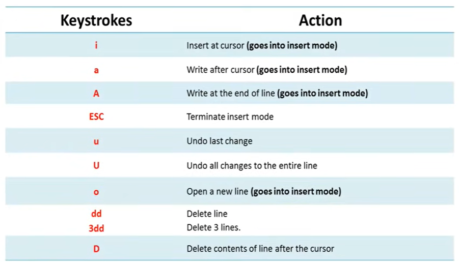
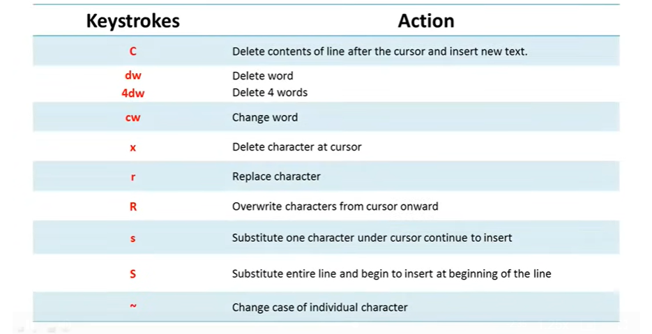
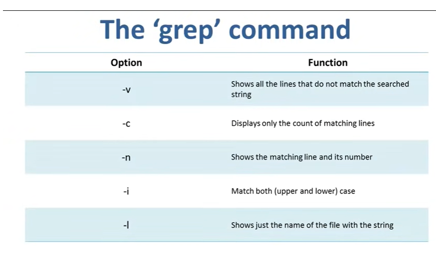

# Playlist

    https://www.youtube.com/watch?v=xRX6ZI_P-LA&list=PLckPQEKYlbxebubMWdjcGR7K_ukm35ZjN

# what is linux

    - Linux refers to the kernel, or the core component, of an operating system. Developed by Linus Torvalds in 1991, Linux is open-source, meaning its source code is available for anyone to view, modify, and distribute. It serves as the foundation for various operating systems, known as Linux distributions or distros, which are built on top of the Linux kernel.

    - Ubuntu is a specific Linux distribution based on Debian, another popular Linux distribution. It was created by Canonical Ltd. and released in 2004. Ubuntu aims to provide a user-friendly and accessible operating system for both desktop and server environments. It comes with a preconfigured set of software, including the GNOME desktop environment, productivity tools, and a software package management system called APT (Advanced Package Tool).

    - In summary, Linux is the underlying kernel that powers various operating systems, while Ubuntu is a specific Linux distribution that uses the Linux kernel as its foundation. Ubuntu is designed to be user-friendly and includes a collection of software and tools to enhance the user experience. Other Linux distributions exist as well, each with its own characteristics and target audience, but Ubuntu is one of the most popular and widely used distributions.

    - Everything is file in linux and unix be it files, folders or devices

# linux commands

# ls

    - displays the files and sub directories(only name) in the current directory

### ls -r

    - displays the files in present in the subdirectories also

### ls -al 

    - shows information related to the files and directories

- hidden files start with a period

-  to display all the hidden files

    - ls -a

# cat command

    - display 
    - copy
    - combine
    - create new text files

### Create new text file 

    cat > FILE_NAME

### display the content of file

    cat FILE_NAME

- NOTE: press ctrl + D to exit the file

### comnbine two files

    cat FILE_NAME_1 FILE_NAME_1 > NEW_FILE_NAME

- NOTE: BASH shell does not give confirmation, It is a silent shell. It only gives error message
             
# Deleting files

### rm commnad

    - rm FILE_NAME

# Move files

### mv command

    mv FILE_NAME NEW_LOCATION

- Note: sudo command is used to run commands with the privilage of super user. the password we enter is retained for 15 minutes

# Remane file

### mv command

    mv FILE_NAME NEW_FILE_NAME

# Crete a new subdirectory in current directory(home directory)

### mkdir command

    - mkdir NAME

### create a new subdirectory in other directiory

    - mkdir  PATH/DIRECTORY_NAME

### create multiple sub directories

    - mkdir DIRECTORY1 DIRECTORY2 DIRECTORY3

# Delete directory

    - rmdir DIRECTORY_NAME

- NOTE:  - TO opem the manual , type man COMMAND_NAME
         - TO paste command -> ctrl + shift + v

# create a new user

    - sudo adduser USER_NAME

# delete user

    - disable a user

        sudo passwd -l USER_NAME

    - delete the account

        sudo userdel -r USER_NAME

### Execute the following command to create a new group:

    - sudo groupadd <groupname>

# add users to usergroups

    - sudo usermod -a -G GROUPNAME USERNAME

    - to see the groups 

        - groupmod + Tab key twice

# remove a user from user group 

    sudo deluser USERNAME GROUPNAME

# finger command

    - used to get information of the logged users on linux machine

    - finger USERNAME gievs the information of a particular user

# permissions in linux

    - users can read(r), write(w), and execute(x) the files in linux

    - there are 3 user types on a linux system viz. user, group and other

    - different users have different permissions 

    - users resinding in a user group have same permissions

    - type ls -l command

    - -rw-rw-r--  -> the first - shows it is a file. d is used for directory(drw-rw-r--)
                  -> the first rw- shows the permissions of user (rwx) (here x is missing so user cannot execute the file)

                  -> the second rw- shows the permissions of user group (rwx) (here x is missing so user cannot execute the file)

                  -> the last r-- shows the permissions of other users (world users)

### changing file/directory permissions

    - chmod permissions filename

    - chmod stands for 'change mode'

    - chmod can be used in two ways

        - absolute(numeric) mode -> in this file permissions are not represented as characters. Rather they are
                                    represented as octal numbers. (https://youtu.be/D-VqgvBMV7g?t=363 )

        - symbolic mode -> we use characters (https://youtu.be/D-VqgvBMV7g?t=445)

### changing ownership and group of the file

    - chown USERNAME FILENAME

    - to change both user and group

        chown USERNAME:GROUPNAME FILENAME

    - to change only user

        chgrp root command

- /etc/groups contains all the group of linux system

-  ### group command is used to find the groups of which you are part of 

### change the group of the user

    newgrp GROUP_NAME

- Two groups can not have the same file

# Editing files in linux

    - There are two methods to edit files in linux

        - terminal -> vi editor
        - GUI
    
    - modes in vi

        - command mode

            - vi editor opens in this mode
            - we can move the cursor, cut, copy , paste the text
            - this modes saves the changes to the file
            - commands are case sensitive

        - insert mode

            - this mode is for inserting text in the file
            - press 'i' in the command mode to open insert mode

            - in insert mode, any key would be taken as input

            - press Esc key to exit

        - command to open vi editor

            - vi <new_file_name>

                or

            - vi <existing_file_name>

### commands in vi editor

# Saving or closing the file

    - these work only in command mode

    - save the file but keep it open
        
        - :w

    - quit without saving

        - :q

    - save the file and quit

        - :wq

# Environmental variables

    - Environmental variables govern behaviour of programs in your operating system

    - commands

        - echo $VARIABLE  -> To display a value of a variable

        - env -> displays all the environmental variables

        - VARIABLE_NAME=variable_name -> creates a new variable

        ** Note there should not be space before or after = 

        - unset VARIABLE_NAME -> remove a variable

        - export VARIABLE_NAME=value -> to set the value of environment variable

# Linux input output redirection 

    - output redirection 

        - command >

        - ex:  
            ls -al > listings
            cat listings

            - this command creates the new file listings having output of ls command in it

        ** Note -> if we use the already existing file, then the content will be overwritten

        - if we do not want the file overwritten, instead want to add more content to the file then

            - command  >>  is used

            - ex: echo hello >> listings

        - Everything is file in linux and unix be it files, folders or devices
        - Every file is associated with a number called file descriptor
        - for ex: monitor has a FD number, then the output of a command in linux is redirected to monitor(file)

    - Error redirection

        - the FD for standard error is 2

        - ex: <command which gives error>   2> error_file_name

            cat error_file_name

        - ex: https://youtu.be/Bzd7XfApxLI?t=338

# Linux filters

    // This one is easy
    https://www.javatpoint.com/linux-file-contents

    https://www.javatpoint.com/linux-filters

# Pipes

    - The symbol '|' denotes the pipe.
    - Use pipes to run two or more commands consecutively
    - Helps in creating  powerful commands

    - ex:  cat fruits | less

    - grep command is used to search a string in file

        grep <string to be searched>

    - ex : cat fruits | grep Avacado  -> search for avacodo in the file fruits

    - ex: cat fruits | grep -i a   -> highlights all the 'a' or 'A' in the file  ( -i is used for ignoring case sensitivity)

# sort the content of file

    - sort <filename> 

        - sort -r <filename> -> reverses sorting
        - sort -n <filename> -> sorts numerically
        - sort -f <filename> -> case insensitive sorting

# filters

    https://youtu.be/VgbnndezHbw?t=234

# jobs and processes in linux

    - a process is an instance of a program

    - any command that you give to linux machine starts a new process

    - two types of processes 

        - foreground process -> requires user input (ex: file editor)
        - background process -> no user intervention is required (ex: antivirus)

    - send process to background and bring it back
        - https://youtu.be/P8GrPOpD8Sk?t=46
    
    - to check all the processes running

        - ps ux

    - to find the process id of a process

        pidof <process name>    (ex pidof firefox)

    - terminate the running process

        - kill PID

    - priority

        https://youtu.be/P8GrPOpD8Sk?t=390

    - see the available and used disk space on the system

        -  df - h

    - free command

        - shows free and used ram on the linux system

        - free -m (shows memeory in magabytes)
        - free -g (shows memeory in gigabytes)
