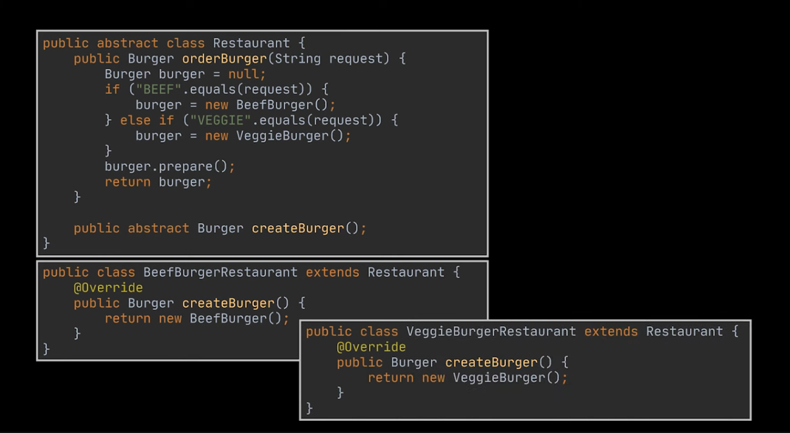
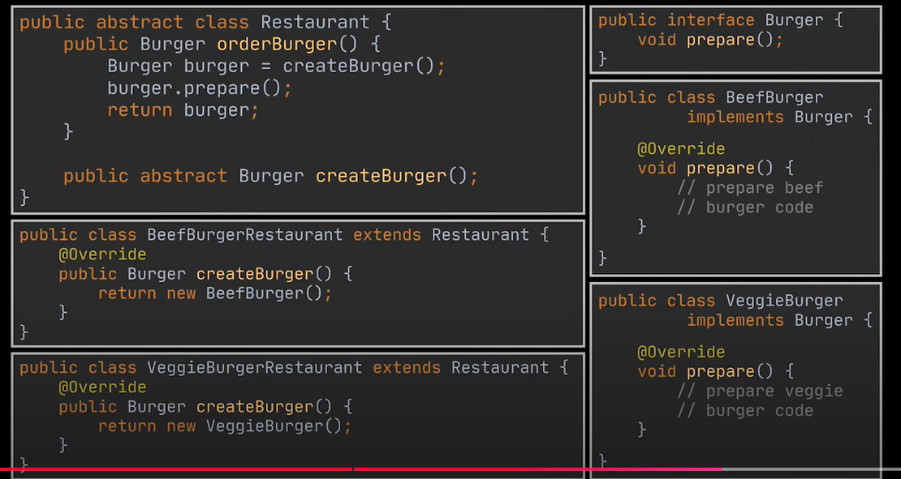
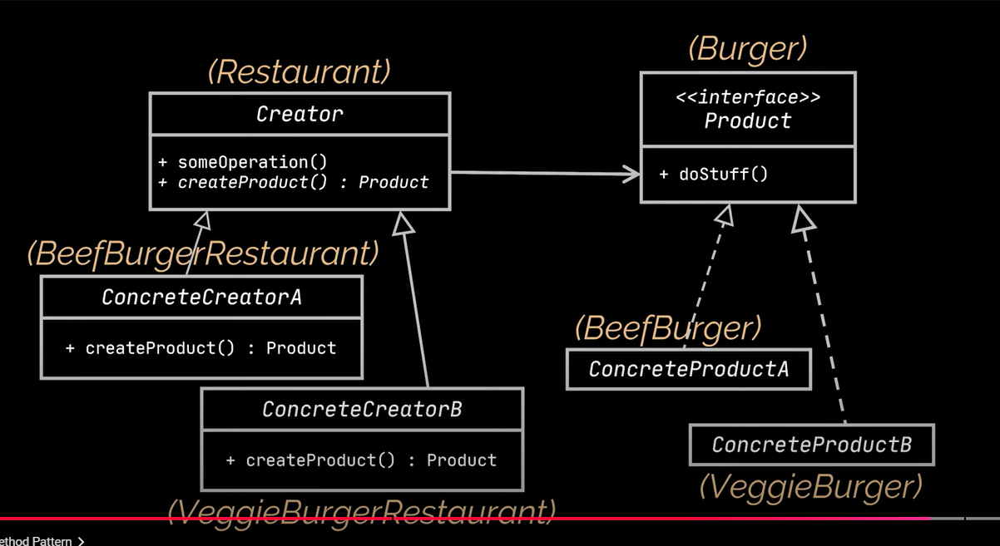
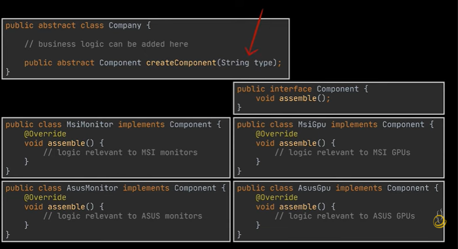
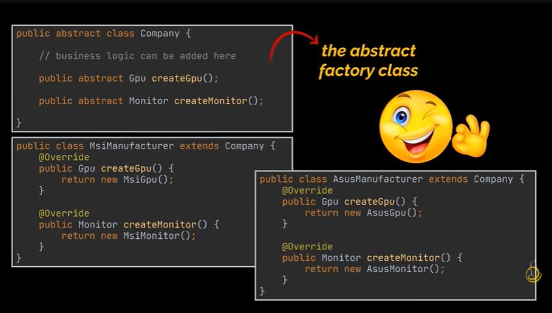
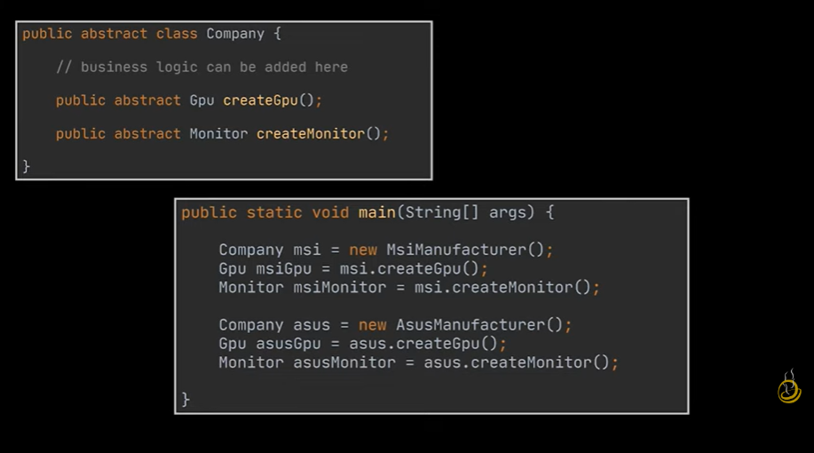
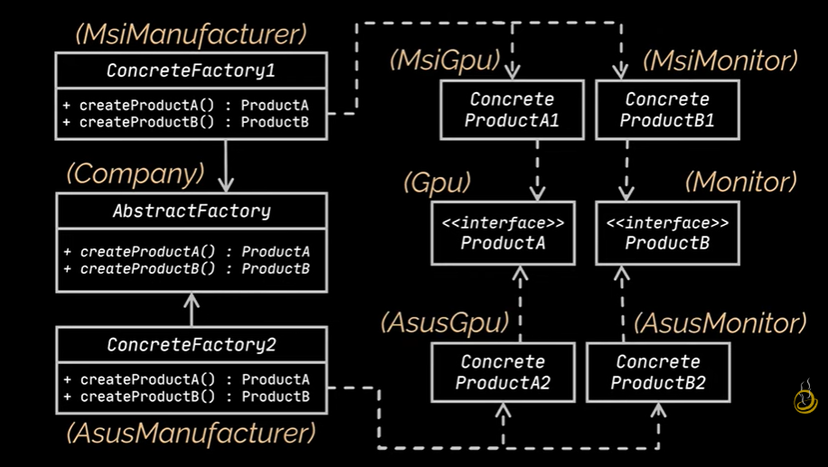
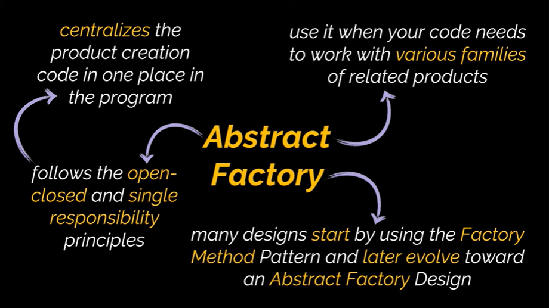

# Factory Pattern

    - Factory pattern loosens the coupling of a given code by seperating the product's contruction code from the code that uses this product

    - Factory pattern states that there should be OCP princlipe. It means that the classes/functions should be open only for extension but closed for modification

    - the Factory method relies heavily on inheritance

    - Use this pattern if we have no idea of exact types of the objects our code will work with

    - It makes it easy to extend the product contruction code independently from the rest of the application

    - It allows introducing new products without breaking the existing code

    - It centralizes the product creation code in one place in the program

    - We use this when we do not want to depend on the request obeject provided by the client. Like the request object can be the type of burger

    - https://www.youtube.com/watch?v=EdFq_JIThqM

# Factory pattern

# Abstract factory pattern

    - https://www.youtube.com/watch?v=QNpwWkdFvgQ

    - Abstract factory allows you to produce families of related objects wothout specifying their concrete classes.

    - The code before applying abstract factory method

    - The dependency on user given request object if we do like this

    - The problem here is that if we add more components, we will have to open these methods and change them

    - This violates the open closed principle

    - This is because a single factory is not enough. Hence we should scale-up the implementation to use the abstract factory design pattern

# Applicability

    -   Use the Factory Method when you don’t know beforehand the exact types and dependencies of the objects your code should work with.

        - The Factory Method separates product construction code from the code that actually uses the product. Therefore it’s easier to extend the product construction code independently from the rest of the code.

    - Use the Factory Method when you want to provide users of your library or framework with a way to extend its internal components.

        - Let’s see how that would work. Imagine that you write an app using an open source UI framework. Your app should have round buttons, but the framework only provides square ones. You extend the standard Button class with a glorious RoundButton subclass. But now you need to tell the main UIFramework class to use the new button subclass instead of a default one.

        - To achieve this, you create a subclass UIWithRoundButtons from a base framework class and override its createButton method. While this method returns Button objects in the base class, you make your subclass return RoundButton objects. Now use the UIWithRoundButtons class instead of UIFramework. And that’s about it!

    - Use the Factory Method when you want to save system resources by reusing existing objects instead of rebuilding them each time.

        - You often experience this need when dealing with large, resource-intensive objects such as database connections, file systems, and network resources.

        - Let’s think about what has to be done to reuse an existing object:

        - First, you need to create some storage to keep track of all of the created objects.
        When someone requests an object, the program should look for a free object inside that pool.
        … and then return it to the client code.

        - If there are no free objects, the program should create a new one (and add it to the pool).
        That’s a lot of code! And it must all be put into a single place so that you don’t pollute the program with duplicate code.

        - Probably the most obvious and convenient place where this code could be placed is the constructor of the class whose objects we’re trying to reuse. However, a constructor must always return new objects by definition. It can’t return existing instances.

        - Therefore, you need to have a regular method capable of creating new objects as well as reusing existing ones. That sounds very much like a factory method.

# Pros and cons

    - Pros

        - You avoid tight coupling between the creator and the concrete products.

        - Single Responsibility Principle. You can move the product creation code into one place in the program, making the code easier to support.

        - Open/Closed Principle. You can introduce new types of products into the program without breaking existing client code.

    - Cons

        - The code may become more complicated since you need to introduce a lot of new subclasses to implement the pattern. The best case scenario is when you’re introducing the pattern into an existing hierarchy of creator classes.

# Difference bw Factory pattern and abstract factory

    - Factory Method Pattern (One Type of Product, Different Variants)

        Imagine a Burger Restaurant that serves different types of burgers (Veg Burger, Chicken Burger, etc.).
        The kitchen (factory method) knows how to make a burger, but the specific type of burger depends on which chef (subclass) is working.
        
        🔹 Example:

            McDonald's kitchen makes only burgers, but different branches might serve Veg Burger or Chicken Burger based on the location.

        📌 Key Takeaway: The Factory Method is used when you need to create one type of product but allow subclasses to define which version (variant) to create.

    - Abstract Factory Pattern (Multiple Related Products)

        Now, imagine a Fast Food Restaurant that serves both Burgers and Fries.

        There are two types of meals:

        Veg Meal → (Veg Burger + Veg Fries)
        Non-Veg Meal → (Chicken Burger + Chicken Fries)
        
        If you order a Veg Meal, you get a Veg Burger & Veg Fries (matching set).

        If you order a Non-Veg Meal, you get a Chicken Burger & Chicken Fries (another matching set).

        🔹 Example:

        KFC or McDonald's offers combo meals where the burger and fries come together, ensuring they are compatible.

        📌 Key Takeaway: The Abstract Factory is used when you need to create multiple related products together, ensuring they match (like a meal combo).

    - Main Difference in One Line:

        ✔ Factory Method = Creates one type of product (Burger, but different variants).
        ✔ Abstract Factory = Creates a family of related products (Burger + Fries combo).
        